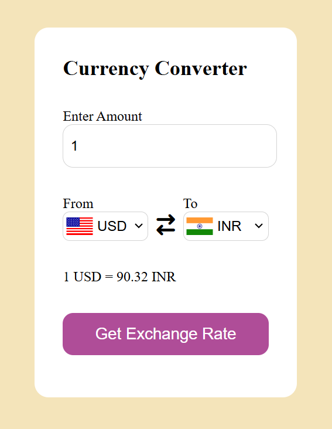

# Currency Converter Web App
A simple and interactive Currency Converter built using HTML, CSS, and JavaScript. It uses a public API to fetch real-time exchange rates and converts any currency to another instantly.

## Features
- Convert any currency to another
- Auto-updating country flags
- Live exchange rate API
- Instant and accurate results
- Clean and simple UI

## Screenshot

## Technologies Used
- HTML5
- CSS3
- JavaScript
- ExchangeRate API
- Flags API

## API Used
Exchange Rate API:
https://api.exchangerate-api.com/v4/latest/{currency}

Flags API:
https://flagsapi.com/{country_code}/flat/64.png

## Folder Structure
index.html
style.css
app.js
codes.js
assets/
   CurrencyConverterInterface.png

## How to Use
1. Enter any amount
2. Select a currency to convert from
3. Select a currency to convert to
4. Click Convert
5. View result instantly

## What I Learned
- Fetching API data
- Handling JSON responses
- Using async/await
- Dynamic DOM updates
- Linking country codes to currency codes

## Author
Shruti Rawat
Frontend Developer